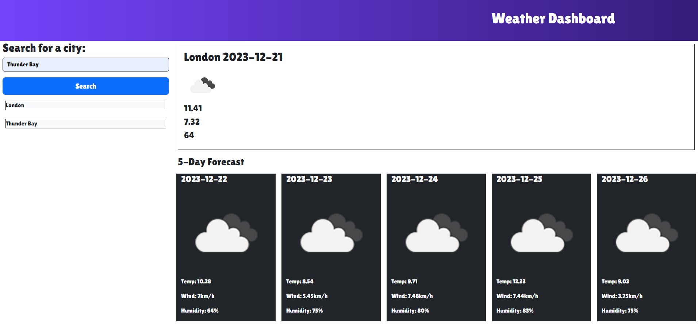

# Weather Dashboard

## Description
        
The purpose of the weather dashboard is to give travellers a place to go where they can search cities and get the current and 5 day forecast for the city. The previously searched cities are added to the page so that the user can toggle back and forth between cities. The dashboard uses html, css, and javascript. The Open Weather Map api was used for the weather data and bootstrap was used as a css framework.  

## Table of Contents

- [Description](#description)
- [Installation](#installation)
- [Usage](#usage)
- [Contribution Guidelines](#contribution-guidelines)
- [Test Instructions](#test-instructions)
- [Questions](#questions)
- [Credits](#credits)
- [License](#license)
        
## Installation
        
N/A
        
## Usage
        
The page is used by searching a city in the search bar and checking the weather for it. Another city can be searched and you can toggle between any cities you have perviously searched by clicking on them in the history.

The page can be accessed via this link: https://loganlagrange.github.io/weather-dashboard/

## Contribution Guidelines

N/A

## Test Instructions

N/A

## Questions

Please direct all questions to my github or email.

Github: [LoganLagrange](https://github.com/LoganLagrange)

Email: lagrangelogan@gmail.com
        
## Credits
    
N/A
        
## License
        
The repo is covered under the standard MIT license. See LICENSE in repo for more info.